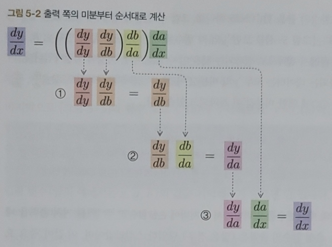
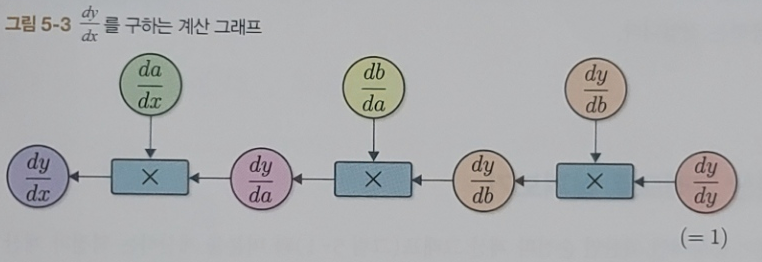

# **제 1고지** 미분 자동 계산
지금부터 시작되는 제 1고지는 총 10단계로 구성됩니다. 여기에선 미분을 자동으로 계산하는 틀을 만듭니다. 미분을 자동으로 계산하기 위해 '변수'와 '함수'를 표현하는 두 클래스 Variable과 Function을 만듭니다.

## **1단계** 상자로서의 변수
### 1.1 변수란?
프로그래밍 입문서에선 상자에 데이터를 넣는 그림을 보여주며 '상자'가 변수라고 설명한다. 이런 설명을 정리하면 아래와 같다.
* 상자(변수)와 데이터는 별개다.
* 상자(변수)에는 데이터가 들어간다. => **대입** 또는 **할당**
* 상자(변수)를 들여다보면 데이터를 알 수 있다. => **참조**

### 1.2 Variable 클래스 구현
변수는 영어로 Variable이라 한다. 따라서, 변수라는 개념을 Variable 이라는 이름의 클래스로 구현하도록 하자. 아래는 이 기능이 최소한으로 구현된 모습이다.
```python
class Variable:
    def __init__(self, data):
        self.data = data
```

참고) 파이썬이 권장하는 코딩 규칙 <a href="https://www.python.org/dev/peps/pep-0008">PEP8</a>

### 1.3 [보충] 넘파이의 다차원 배열
다차원 배열에서는 원소의 순서에 방향이 있고, 이 방향을 **차원(dimension)** 혹은 **축(axis)** 이라 한다. 0차원 배열, 1차원 배열, 2차원 배열을 각각 **스칼라(scalar)**, **벡터(vector)**, **행렬(matrix)** 이라 한다. 다차원 배열을 **텐서(tensor)** 로 부르기도 한다. 

## **2단계** 변수를 낳는 함수
앞 단계에서 Variable 클래스를 상자로 사용할 수 있도록 하였다. 그러나 지금은 단순한 상자일 뿐이다. 따라서 우리는 단순한 상자를 마법의 상자로 바꾸는 장치가 필요하고 이를 '함수'라 한다. 

### 2.1 함수란?
함수를 딱딱하게 표현하면 *'어떤 변수로부터 다른 변수로의 대응 관계를 정한 것'*이라 할 수 있다. 변수 $x$와 $y$, 그리고 함수 $f$의 관계를 그림으로 나타낼 수 있다. 원과 사각형모양의 노드를 화살표로 연결해 계산 과정을 표현한 그림을 **계산 그래프(computational graph)** 라 한다. 

### 2.2 Function 클래스 구현
앞서 구현한 Variable 인스턴스를 변수로 다룰 수 있는 함수를 Function 클래스로 구현한다. 이 때, 주의할 점은 2가지이다.
* Function 클래스는 Variable 인스턴스를 입력받아 Variable 인스턴스를 출력한다.
* Variable 인스턴스의 실제 데이터는 인스턴스 변수인 data에 있다.

위 두 가지에 유의하며 Function 클래스를 아래와 같이 구현한다.
``` python
class Function:
    def __call__(self, input: Variable):
        x = input.data # 데이터를 꺼낸다.
        y = x ** 2 # 실제 계산
        output = Variable(y) # 계산 결과를 Variable의 형태로 만든다.
        return output
```
<p> __call__ 메소드의 인수 input은 Variable 인스턴스라 가정하고 데이터를 꺼내 원하는 계산을 한 뒤 결과를 Varable이라는 '상자'에 담아 돌려준다. </p>

### 2.3 Function 클래스의 이용
Function 클래스를 실제로 사용해보도록 하자. 

```python
x = Variable(np.array(10))
f = Function()
y = f(x)

print(type(y)) # type() 함수는 객체의 클래스를 알려준다.
print(y.data)
```
실행 결과
```
<class '__main__.Variable'>
100
```
이와 같이 Variable과 Function을 연계할 수 있다. 실행 결과를 보면 y의 클래스는 Variable이고, 데이터는 y.data에 잘 저장되었음을 확인할 수 있다.

그러나 방금 구현한 Function 클래스의 용도는 '입력값의 제곱'으로 고정된 함수이다. 따라서 Sqaure라는 이름이 더 어울린다. 앞으로 여러 기능을 하는 함수가 필요하다는 점을 고려하면 Function 클래스는 기반 클래스로 두고 모든 함수가 공통적으로 제공하는 기능만 담아두는 것이 좋다. 그래서 앞으로 모둔 함수는 다음의 두 사항을 충족하도록 구현하자.
* Function 클래스는 기반 클래스로서, 모든 함수에 공통되는 기능을 구현한다.
* 구체적인 함수는 Function 클래스를 상속한 클래스에서 구현한다.

이를 위해 Function 클래스를 아래와 같이 수정한다.
``` python
class Function:
    def __call__(self, input: Variable):
        x = input.data
        y = self.forward(x)
        output = Variable(y)
        return output
    
    def forward(self, x: Variable):
        raise NotImplementedError()
```
<p> __call__ 메서드를 살짝 수정하고 forward라는 메서드를 추가하였다. __call__ 메서드는 Variable에서 데이터를 가져오고, 계산 결과를 Variable에 포장하는 두 가지 일을 한다. 구체적인 계산은 forward를 호출하여 수행한다. forward 메서드의 구체적인 로직은 하위 클래스에서 구현 하도록 한다. </p>

```
Funtion클래스의 forward 메서드는 예외를 발생시킨다. 따라서 Function 클래스의 forward 메서드를 직접 호출한 사람에게 '이 메서드는 상속해 구현해야 한다.'는 사실을 알려줄 수 있다.
```
이어 Function 클래스를 상속하여 입력값을 제곱하는 클래스를 구현하도록 하자. 클래스의 이름은 Square라 짓고 다음과 같이 구현한다.

``` python
class Square(Function):
    def forward(self, x):
        return x ** 2
```

<p> Square 클래스는 Function 클래스를 상속하기 때문에 __call__ 메서드는 그대로 계승된다. 따라서 forward 메서드에 구체적인 계산 로직을 작성해 넣는 것 만으로 구현은 끝이 난다. </p>

## **3 단계** 함수 연결
이번 단계에서는 또 다른 함수를 구현하고 여러 함수를 조합해 계산할 수 있도록 하겠다.

### 3.1 Exp 함수 구현
$y=e^{x}$를 계산하는 함수를 구현하도록 하겠다. 여기서 $e$는 자연로그의 밑(base of the natural lograithm)이다. 오일러 수 네이피어 상수라고도 한다. 구현은 아래와 같다.
```python
class Exp(Function):
    def forward(self, x):
        return np.exp(x)
```

### 3.2 함수 연결
Function 클래스의 ```__call__``` 메서드는 입력과 출력이 모두 Variable 인스턴스이므로 자연스럽게 함수를 연이어 사용할 수 있다. $y=(e^{x^{2}})^{2}$이라는 계산을 예로 생각할 수 있다.
```python
A = Square()
B = Exp()
C = Square()

x = Variable(np.array(0.5))
a = A(x)
b = B(a)
y = C(b)
print(y.data)
```
**실행 결과**
```
1.648721270700128
```
3개의 함수 A, B, C를 연이어 적용했다. 여기서 중요한 점은 중간에 등장하는 4개의 변수(x, a, b, y)는 모두 Variable 인스턴스라는 점이다. Function 클래스의 ```__call__```메서드의 입출력이 Variable 인스턴스로 통일되어있어 여러 함수를 연속하여 적용할 수 있다. ```C(B(A(x)))```처럼도 가능하다는 것이다. 일련의 계산 과정을 '계산 그래프'로 표현할 수 있는데, 계산 그래프를 이용하면 각 변수에 대한 미분을 효율적으로 계산할 수 있다. 변수별 미분을 계산하는 알고리즘이 역전파(backpropagation)이다. 다은 단계부터 이 역전파를 구현해보도록 하자.

## **4 단계** 수치 미분
지금까지 Variable 클래스와 Function 클래스를 구현했다. 이 클래스들을 구현한 이유는 미분을 자동으로 계산하기 위해서이다. 이번 단계에서는 미분이 무엇인지와 수치 미분이라는 간단한 방법으로 미분을 계산해보도록 하겠다. 그 다음 5단계에서 수치 미분을 대신하는 더 효율적인 알고리즘(역전파)를 구현할 계획이다.
```
머신러닝 외에 유체 역학, 금융 공학, 기상 시뮬레이션, 엔지니어링 설계 최적화 등 많은 분야에서 미분을 활용한다.
```

### 4.1 미분이란?
<var id="exp_4_1">미분이 무엇일까? 쉽게 얘기하면 _'변화율'_을 뜻한다. 정확한 정의는 '극한으로 짧은 시간'에서의 변화량을 뜻한다. 이를 수식으로 표현하면 함수 $f(x)$가 있을 때 미분은 다음과 같이 정의 된다.</var>
   
$$ f'(x) = \lim_{h \rightarrow 0}{{f(x+h) - f(x)} \over {h}} $$

만약 $x = a$ ($a$는 상수)일 때의 값을 점 $a$에 대한 $f(x)$의 **미분**이라 한다. $y=f(x)$가 어떤 구간에서 미분 가능하다면 [[식4.1]](#exp_4_1)은 해단 구간의 '모든 $x$'에 대해 성립한다. 따라서 [[식 4.1]](#exp_4_1)의 $f'(x)$도 함수이고, $f(x)$의 **도함수**라 한다.

### 4.2 수치 미분 구현
그럼 미분을 정의한 [[식 4.1]](#exp_4_1)에 따라 미분을 계산하는 코드를 구현해 보자. 그러나 컴퓨터는 극한을 취급할 수 없으니 $h$를 극한과 비슷한 매우 작은 값으로 대체할 수 있다. 이런 미세한 차이를 이용해 함수의 변화량을 구하는 방법을 **수치 미분(numerical differentiation)** 라 한다. 따라서 값에 약간의 오차가 생기는데 이 근사 오차를 줄이는 방법으로는 
**중앙 차분(centered differentiation)** 이라는 것이 있다. 중앙 차분은 $f(x + h) - f(x)$를 구하는 대신 $f(x + h) - f(x - h)$의 차이를 구한다. $f(x + h) - f(x)$를 이용해 기울기를 구하는 방법을 **'전진 차분(forweard difference)'** 라 하는데 중앙차분 쪽이 상대적으로 오차가 적다. 이는 테일러 급수를 이용해 중앙차분이 전진차분에 비해 실제 미분값과 가깝다는 것을 증명할 수 있다. 이제 중앙차분을 이용한 수치 미분 계산 함수 numerical_diff(f, x, eps=1e-4)를 구현해보도록 하자. 첫 번째 인수는 미분의 대상이 되는 함수이고, 두 번째 인수 x는 미분을 계산하는 변수이며, 마지막 eps는 작은 값을 나타내고 기본적으로 1e-4이다. 수치 미분은 아래와 같이 구현될 수 있다.
```python
def numerical_diff(f: Function, x: Variable, eps=1e-4):
    x0 = Variable(x.data - eps)
    x1 = Variable(x.data + eps)
    y0 = f(x0)
    y1 = f(x1)
    return (y1.data - y0.data) / (2 * eps)
```
아래는 3 단계에서 구현한 Square 클래스를 대상으로 미분한 것이다.
```python
f = Square()
x = Variable(np.array(2.0))
dy = numerical_diff(f, x)
print(dy)
```
실행 결과
```
4.000000000004
```
이렇게 함수 $y=x^{2}$에서 $x=2.0$일 때, 수치 미분한 결과를 구했다. 오차가 없으면 4.0이므로 이 결과는 거의 올바르다 할 수 있다.

참고) Todd Young, Marint J. Mohlenkamp. "[Introduction to Numerical Methods and Matlab Programming for Engineers](http://www.ohiouniversityfaculty.com/youngt/IntNumMeth/book.pdf) - Lecture 27: Numerical Differentiation" (2019.11)

### 4.3 합성 함수의 미분
지금까지는 $y=x^{2}$이라는 단순한 함수를 다뤘다. 이어 합성함수를 미분해보도록 하자. $y=(e^{x^{2}})^{2}$이라는 계산에 대한 미분 ${dy}\over{dx}$를 계산할 것이다. 코드는 다음과 같다.
```python
def f(x):
    A = Square()
    B = Exp()
    C = Square()
    return C(B(A(x)))

x = Variable(np.array(0.5))
dy = numerical_diff(f, x)
print(dy)
```
실행 결과
```
3.2974426293330694
```
이상으로 미분을 '자동'으로 계산하는 데 성공하였다. 위 합성 함수 $f$의 해석학적인 미분은 $4xe^{2x^{2}}$ 이다. $x=0.5$에서의 미분은 $2e^{0.5}$이므로 약 ```3.2974425414002564```이다. 따라서 위 계산과 오차가 거의 나지 않음을 확인 할 수 있다. 이 방식으로 아무리 복잡하게 조합된 함수여도 미분을 자동으로 계산할 수 있다. 그러나 안타깝게도 이 수치 미분에는 문제가 있다.

### 4.4 수치 미분의 문제점
위에서 여러번 살펴봤듯 수치 미분의 결과에는 항상 오차가 포함되어 있다. 대부분의 경우 오차는 매우 작지만 어떤 계산을 하냐에 따라 커질 수도 있다. 또, 수치 미분의 더 심각한 문제는 계산량이 많다는 점이다. 변수가 여러 개인 계산을 미분할 경우 변수 각각을 미분하여야한다. 신경망에선 매개변수를 수백만 개 이상 사용하는건 일도 아니므로 이 모두를 수치 미분하는 것은 현실적이지 못하다. 그래서 등장한 것이 역전파이다. 다음 단계에서 드디어 역전파를 소개한다.

수치 미분은 구현하기 쉽고 거의 정확한 값을 얻을 수 있다. 이에 비해 역전파는 알고리즘이 복잡하여 구현하면서 버그가 섞여 들어가기 쉽다. 그래서 역전파를 정확하게 구현했는지 확인하기 위해 수치 미분의 결과를 이용하곤 한다. 이를 **기울기 확인(gradient checking)** 라 하는데, 단순히 수치 미분 결과와 역전파의 결과를 비교하는 것이다. 기울기 확인은 10 단계에서 구현하기로 하자.

## **5 단계** 역전파 이론
역전파를 이용하면 미분을 효율적으로 계산할 수 있고 결괏값의 오차도 더 작다. 이번 단계에서는 구현보다는 이론 설명에 집중하도록 한다.

### 5.1 연쇄 법칙
<var id="exp_5_1">역전파를 이해하는 열쇠는 **연쇄 법칙(chain rule)**이다. 연쇄 법칙에 따르면 합성 합수의 미분은 구성함수 각각을 미분한 후 곱한 것과 같다. 예를 들어 $y = F(x)$라는 함수가 있다고 가정하자. 이 함수는 $a = A(x)$, $b=B(a)$, $c = C(b)$라는 세 함수로 구성되어 있다. 이 때 $x$에 대한 $y$의 미분은 [식 5.1]로 표현할 수 있다.</var>

$$ {{dy} \over {dx}} = {dy \over db}{db \over da}{da \over dx}$$

<var id="exp_5_2">[[식 5.1]](#exp_5_1)에서 알 수 있듯 $x$에 대한 $y$의 미분은 구성 함수 각각의 미분값을 모두 곱한 값과 같다. 즉, 합성함수의 미분은 각 함수의 국소적인 미분들로 분해할 수 있다. 이것이 연쇄 법칙이다. 또한 [[식 5.1]](#exp_5_1) 앞에 다음과 같이 $dy \over dy$를 명시할 수도 있다.</var>

$$ {dy \over dx} = {dy \over dy}{dy \over db}{db \over da}{da \over dx}$$

$dy \over dy$는 '자신'에 대한 미분이라 항상 1이다. 역전파를 구현할 때를 대비하기 위해 포함한다.

### 5.2 역전파 원리 도출
<var id="exp_5_3">이제 [[식 5.2]](#exp_5_2)는 합성함수의 미분은 구성함수들의 미분의 곱으로 분해할 수 있음을 뜻한다. [식 5.3]과 같이 출력에서 입력 방향으로 (즉, 역방향으로) 계산해보도록 하겠다. </var>

$${dy \over dx}=\left(\left({dy \over dy}{dy \over db}\right){db \over da}\right){da \over dx}$$

[식 5.3]과 같이 출력에서 입력 방향으로, 즉 보통의 계산과는 반대 방향으로 미분을 계산합니다. 이때 계산 흐름은 아래 [그림 5-2](#png_5_2)와 같다.

<center></img></center>

이를 계산 그래프로는 [그림 5-3](#png_5_3)처럼 된다.

<center></img></center>

우선 ${{dy}\over{dy}}(=1)$에서 시작하여 ${dy \over db}$와 곱한다. 여기서 ${dy \over db}$는 $y=C(b)$의 미분이다. 따라서 함수 $C$의 도함수를 $C'$로 나타내면 ${dy \over db}=C'(b)$로 나타낼 수 있다. 마찬가지로 ${db \over da}=B'(a)$이고 ${da \over dx}=A'(x)$이다.

이렇게 도함수의 곱을 함수 노드 하나로 그릴 수 있다. 이제 미분값이 전파되는 흐름이 명확해진다. 변수 $y, b, a, x$에 대한 미분값이 오른쪽에서 왼쪽으로 전파됨을 알 수 있다. 이를 역전파라 한다. 여기서 중요한 점은 데이터가 모두 'y의 미분값'이라는 점이다. 머신러닝은 주로 대량의 매개변수를 입력 받아 마지막에 **손실 함수(loss function)**을 거쳐 출력을 내는 형태로 진행된다. 손실 함수의 각 매개변수에 대한 미분을 계산해야한다. 따라서 미분값을 출력에서 입력 방향으로 전파하면 한 번의 전파만으로 모든 배개변수에 대한 미분을 계산할 수 있다. 이렇게 계산이 효율적으로 이루어지기 때문에 미분을 반대 방향으로 전파하는 역전파를 이용한다.

### 5.3 계산 그래프로 살펴보기
순전파와 역전파의 관계는 명확하다. 각각의 변수는 y의 해당 변수에 대한 미분값에 대응하고 함수는 역전파의 도함수에 대응한다. 이렇게 변수는 '통상값'과 '미분값'이 존재하며, 함수는 '통상 계산(순전파)'과 '미분값을 구하기 위한 계산(역전파)'가 존재하는 것으로 생각할 수 있다

역전파를 계산할 떈, 순전파에 이용한 데이터가 필요하다. 따라서 역전파를 구현하려면 먼저 순전파를 하고, 이때 각 함수가 입력 변수의 값을 기억해둬야한다. 그런다음에야 각 함수의 역전파를 계산할 수 있다.

## **6 단계** 수동 역전파
이번 단계에서는 Variable과 Function클래스를 확장해 역전파를 이용한 미분을 구현한다.

### 6.1 Variable 클래스 추가 구현
역전파에 대응하는 Variable 클래스를 구현하기 위해 통상값(data)와 더불어 대응하는 미분값(grad)도 저장하도록 확장한다.

```python
class Variable:
    def __init__(self, data):
        self.data = data
        self.grad = None
```

### 6.2 Function 클래스 추가 구현
이전 단계까지의 Function 클래스는 일반적인 계산을 하는 순전파(forward 메서드) 기능만 지원하는 상태이다. 이외 아래 두 기능을 추가한다.
* 미분을 계산하는 역전파(backward 메서드)
* forward 메서드 호출시 건네받은 Variable 인스턴스 유지

```python
class Function:
    def __call__(self, input: Variable):
        self.input = input # 입력 변수를 기억한다.
        x = input.data
        y = self.forward(x)
        output = Variable(y)

        return output
    
    def forward(self, x):
        raise NotImplementedError()
    
    def backward(self, gy):
        raise NotImplementedError()
```

코드에서 보듯 ```__call__``` 메서드에서 입력된 input을 인스턴스 변수인 self.input에 저장한다. 이렇게 나중에 backward 메서드에 함수에 입력한 변수가 필요할 때, self.input에서 가져와 사용할 수 있다.

### 6.3 Square와 Exp 클래스 추가 구현
이어 Function을 상속한 구체적인 함수에 역전파(backward)를 구현한다. 우선 제곱을 게산하는 Square 클래스이다. $y=x^2$의 미분은 ${dy \over dx}=2x$가 되기 때문에 아래처럼 구현할 수 있다.
```python
class Square(Function):
    def forward(self, x):
        return np.square(x)

    def backward(self, gy):
        x = self.input.data
        gx = 2 * x * gy
        return gx
```
이와 같이 역전파를 담당하는 backward 메서드를 추가하였다. 이 메서드의 인수 gy는 ndarray의 인스턴스이며, 출력 쪽에 전해지는 미분값을 전달하는 역할을 한다. 역전파에서는 이 결과값이 입력 쪽에 더 가까운 다음 함수로 전파해 나간다.

이어 $y=e^x$를 계산할 Exp 클래스이다. 이 계산의 미분은 ${dy \over dx}=e^x$이기 때문에 다음과 같이 구현할 수 있다.
```python
class Exp(Function):
    def forward(self, x):
        return np.exp(x)
    
    def backward(self, gy):
        x = self.input.data
        gx = np.exp(x) * gy
        return gx
```
이번 절에서는 계산의 미분을 역전파로 계산해보도록 하자
```python
    A = Square()
    B = Exp()
    C = Square()

    x = Variable(np.array(.5))
    a = A(x)
    b = B(a)
    c = C(b)
```
이어 역전파로 y를 미분해보자. 순전파 때와는 반대로 각 함수의 backward메서드를 호출하면 된다.
```python
y.grad = np.array(1.0)
b.grad = C.backward(y.grad)
a.grad = B.backward(b.grad)
x.grad = A.backward(a.grad)
print(x.grad)
```
**실행 결과**
```
3.297442541400256
```
위 결과값과 4단계에서 구한 수치 미분의 결과와 거의 같음을 알 수 있다. 이는 역전파를 제대로 구현했을 가능성이 큼을 뜻한다.

그러나 역전파 순서에 맞춰 호출하는 코드를 일일이 작성해서 넣는건 불편하다. 따라서 다음 단계에서는 이 작업을 자동화 하도록 한다.

## **7 단계** 역전파 자동화
이전 단계에서 역전파를 동작시키는 데 성공했다. 그러나 역전파 계산 코드를 수동으로 조합해야했다. 새로운 계산을 할 때 마다 역전파 코드를 직접 작성해야하는 것은 매우 귀찮고 지루하니 자동화 하도록 하자. 일반적인 계산(순전파)를 한 번만 해주면 자동으로 역전파가 이루어지는 구조를 만들자. 지금부터가 Define-by-Run의 핵심을 건드리는 내용이다. 
```Define-by-Run이란 딥러닝에서 수행하는 계산들을 계산 시점에 '연결'하는 방식으로 '동적 계산 그래프'라고도 한다.```
계산 그래프는 모두 일직선으로 늘어선 계산이다. 따라서 함수의 순서를 리스트의 형태로 저장해두었다 나중에 거꾸로 추적하는 식으로 역전파를 자동화할 수 있다. 그러나 분기가 있는 계산 그래프나 같은 변수가 여러번 사용되는 복잡한 계산 그래프는 단순히 리스트로 저장하는 식으로 풀 수 없다. 따라서 우리의 목표는 아무리 복잡한 계산 그래프라 하더라도 역전파를 자동으로 할 수 있는 구조를 마련하는 것이다. 

### 7.1 역전파 자동화의 시작
역전파 자동화로 가는 길은 변수와 함수의 '관계'를 이해하는데 출발한다. 우선 함수 입장에서는 변수는 '입력'과 '출력'에 쓰인다. 변수 입장에서는 어떨까? 변수는 함수에 의해 '만들어진다'.
일단 함수와 변수의 관계를 코드에 녹여보도록 하자. 여기에선 일반적인 계산(순전파)이 이루어지는 시점에 '관계'를 맺어주도록 만들자. 이를 위해 우선 Variable 클래스에 다음 코드를 추가한다.
```python
class Variable:
    def __init__(self, data):
        self.data = data
        self.grad = None
        self.creator = None

    def set_creator(self, func):
        self.creator = func
```
creator라는 인스턴스 변수를 추가하였다. 그리고 creator를 설정할 수 있도록 set_creator 메서드도 추가한다. 이어 Function 클래스에 다음 코드를 추가한다.

```python
class Function:
    def __call__(self, input):
        self.input = input
        x = input.data
        y = self.forward(x)
        output = Variable(y)
        output.set_creator(self)    # 출력 변수에 창조자를 설정한다.
        self.output = output        # 이어 출력도 저장한다.
        return output
```
순전파를 계속하면 그 결과로 output이라는 Variable 인스턴스가 생성된다. 이때 생성된 output에 '내가 너의 창조자임'을 기억시킨다. 이 부분이 '연결'을 동적으로 만드는 기법의 핵심이다. 그 다음 output을 인스턴스 변수에 저장했다. 이와 같이 '연결'된 Variable과 Function이 있다면 계산 그래프를 거꾸로 거슬러 올라갈 수 있다. 구체적인 코드는 아래와 같다.
```python
    A = Square()
    B = Exp()
    C = Square()

    x = Variable(np.array(0.5))
    a = A(x)
    b = B(a)
    y = C(b)

    # 계산 그래프의 노드들을 거꾸로 거슬러 올라간다.
    assert y.creator == C
    assert y.creator.input == b
    assert y.creator.input.creator == B
    assert y.creator.input.creator.input == a
    assert y.creator.input.creator.input.creator == A
    assert y.creator.input.creator.input.creator.input == x
```
우선 assert 문은 평가 결과가 True가 아니면 ```AssertionError```를 발생시킨다. 위의 코드는 문제없이 실행되므로 assert 문의 모든 조건이 충족함을 알 수 있다.

### 7.2 역전파 도전!
변수와 함수의 관계를 이용해 역전파를 시도해보도록 하자. 우선 y에서 b까지의 역전파를 시도해보자.
```python
y.grad = np.array(1.0)

C = y.creator               # 1. 함수를 가져온다.
b = C.input                 # 2. 함수의 입력을 가져온다.
b.grad = C.backward(y.grad) # 3. 함수의 backward 메서드를 호출한다.
```
y의 인스턴스 변수 creator에서 함수를 얻어오고, 그 함수의 input에서 입력 변수를 가져온다. 그런 다음 함수의 backward 메서드를 호출한다. 이어 변수 b에서 a로의 역전파를 보자.
```python
B = b.creator               # 1. 함수를 가져온다.
a = B.input                 # 2. 함수의 입력을 가져온다.
a.grad = B.backward(b.grad) # 3. 함수의 backward 메서드를 호출한다.
```
마지막으로 변수 a에서 x로의 역전파를 살펴보자.
```python
A = a.creator               # 1. 함수를 가져온다.
x = A.input                 # 2. 함수의 입력을 가져온다.
x.grad = A.backward(a.grad) # 3. 함수의 backward 메서드를 호출한다.
```
실행 결과
```
3.297442541400256
```
이상으로 모든 역전파가 끝났다.

### 7.3 backward 메서드 추가
아까의 역전파 코드에는 똑같은 처리 흐름이 반복해 나타난다. 따라서 이런 반복 작업을 자동화할 수 있도록 Variable 클래스에 backward라는 새로운 메서드를 추가하자.
```python
class Variable:
    def __init__(self, data):
        self.data = data
        self.grad = None
        self.creator = None

    def set_creator(self, func):
        self.creator = func

    def backward(self):
        f = self.creator    # 1. 함수를 가져온다.
        if f is not None:
            x = f.input     # 2. 함수의 입력을 가져온다.
            x.grad = f.backward(self.grad)  # 3. 함수의 backward 메서드를 호출한다.
            x.backward()    # 하나 앞 변수의 backward 메서드를 호출한다. (재귀)
```
Variable 클래스의 backward 메서드는 지금까지 반복한 처리 흐름과 거의 동일하다. Variable의 생성 함수를 얻어오고 그 함수의 입력 변수를 가져온다. 그 다음 함수의 backward 메서드를 호출해 현재 변수의 미분값을 계산한다. 이런식으로 각 변수의 backward 메서드가 재귀적으로 불리게 된다.
```Variable 인스턴스의 creator가 None이면 역전파가 종료된다. 창조자가 없으므로 이 Variable은 인스턴스 함수 바깥에서 생성됐음을 뜻한다. 따라서 높은 확률로 사용자가 만들어 건덴 변수일 것이다.```
이제 새로워진 Variable을 이용해 역전파가 자동으로 실행되는 모습을 보자.
```python
    A = Square()
    B = Exp()
    C = Square()

    x = Variable(np.array(0.5))
    a = A(x)
    b = B(a)
    y = C(b)

    # 역전파
    y.grad = np.array(1.0)
    y.backward()
    print(x.grad)
```
**실행 결과**
```
3.297442541400256
```
이와 같이 변수 y의 backward 메서드를 호출해 역전파가 자동으로 진행된다. 실행 결과도 지금까지와 동일하다. 

## **8 단계** 재귀에서 반복문으로
앞 단계에서는 Variable 클래스에 backward 메서드를 추가했습니다. 이번엔 처리 효율을 개선하고 앞으로 확장을 대비해 backward 메서드의 구현 방식을 바꿔보도록 하자.

### 8.1 현재의 Variable 클래스
이전에 Variable 클래스의 backward 메서드를 아래와 같이 구현하였다.
```python
class Variable:
        ... # 생략

        def backward(self):
            f = self.creator
            if f is not None:
                x = f.input
                x.grad = f.backward(self.grad)
                x.backward()
```
이 backward 메서드에서 눈에 밟히는 부분은 하나 앞 변수의 backward 메서드를 호출하는 코드이다. 'backward' 메서드에 재귀 구조로 되어있다.

### 8.2 반복문을 이용한 구현
이번 절에서는 지금까지의 '재귀를 사용한 구현'을 '반복문을 이용한 구현'으로 고쳐보자. 코드는 아래와 같다.
```python
class Variable:
    ...

    def backward(self):
        funcs = [self.creator]
        while funcs:
            f = funcs.pop()             # 함수를 가져온다.
            x, y = f.input, f.output    # 함수의 입력과 출력을 가져온다.
            x.grad = f.backward(y.grad) # backward 메서드를 호출한다.

            if x.creator is not None:
                funcs.append(x.creator) # 하나 앞의 함수를 리스트에 추가한다.
```
while 블록 안에 func.pop()을 호출해 처리할 함수 f를 꺼내고, f의 backward 메서드를 호출한다. 이때 f의 input과 output에서 입출력 변수를 얻음으로써 f.backward()의 인수와 반환값을 올바르게 설정할 수 있다.

### 8.3 동작 확인
개선된 Variable 클래스를 사용해 실제 미분을 해보도록 하자. 7단계에서와 똑같은 코드를 실행해보자.
```python
A = Square()
B = Exp()
C = Square()

x = Variable(np.array(0.5))
a = A(x)
b = B(a)
y = C(b)

# 역전파
y.grad = np.array(1.0)
y.backward()
print(x.grad)
```
**실행 결과**
```
3.297442541400256
```
결과도 이전과 같다. 이렇게 재귀가 아닌 반복문으로 구현하는 방식의 이유는 15단계에서 알 수 있다. 15단계에선 복잡한 계산 그래프를 다루는데, 방금 전환한 덕분에 부드럽게 확장할 수 있다. 처리 효율도 반복문의 방식이 더 뛰어나다.
